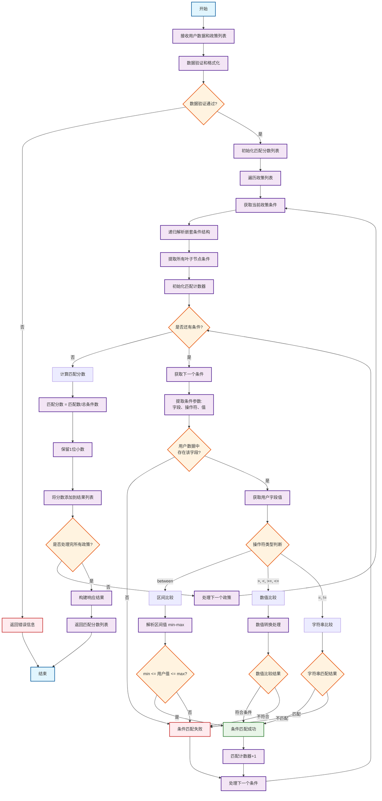

```mermaid
flowchart TD
    A[开始] --> B[接收用户数据和政策列表]
    B --> C[数据验证和格式化]
    C --> D{数据验证通过?}
    D -->|否| E[返回错误信息]
    D -->|是| F[初始化匹配分数列表]
    
    F --> G[遍历政策列表]
    G --> H[获取当前政策条件]
    H --> I[递归解析嵌套条件结构]
    
    I --> J[提取所有叶子节点条件]
    J --> K[初始化匹配计数器]
    K --> L{是否还有条件?}
    
    L -->|否| M[计算匹配分数]
    L -->|是| N[获取下一个条件]
    N --> O[提取条件参数:<br/>字段、操作符、值]
    
    O --> P{用户数据中<br/>存在该字段?}
    P -->|否| Q[条件匹配失败]
    P -->|是| R[获取用户字段值]
    
    R --> S{操作符类型判断}
    S -->|between| T[区间比较]
    S -->|>, <, >=, <=| U[数值比较]
    S -->|=, !=| V[字符串比较]
    
    T --> W[解析区间值 min-max]
    W -->     X{min <= 用户值 <= max?}
    X -->|是| Y[条件匹配成功]
    X -->|否| Q
    
    U --> Z[数值转换处理]
    Z --> AA{数值比较结果}
    AA -->|符合条件| Y
    AA -->|不符合| Q
    
    V --> BB{字符串匹配结果}
    BB -->|匹配| Y
    BB -->|不匹配| Q
    
    Y --> CC[匹配计数器+1]
    CC --> DD[处理下一个条件]
    Q --> DD
    DD --> L
    
    M --> EE[匹配分数 = 匹配数/总条件数]
    EE --> FF[保留1位小数]
    FF --> GG[将分数添加到结果列表]
    
    GG --> HH{是否处理完所有政策?}
    HH -->|否| II[处理下一个政策]
    II --> H
    HH -->|是| JJ[构建响应结果]
    
    JJ --> KK[返回匹配分数列表]
    KK --> LL[结束]
    E --> LL
    
    %% 样式定义
    classDef startEnd fill:#e1f5fe,stroke:#01579b,stroke-width:2px
    classDef process fill:#f3e5f5,stroke:#4a148c,stroke-width:2px
    classDef decision fill:#fff3e0,stroke:#e65100,stroke-width:2px
    classDef error fill:#ffebee,stroke:#c62828,stroke-width:2px
    classDef success fill:#e8f5e8,stroke:#2e7d32,stroke-width:2px
    
    class A,LL startEnd
    class B,C,F,G,H,I,J,K,N,O,R,W,Z,CC,DD,EE,FF,GG,II,JJ,KK process
    class D,L,P,S,X,AA,BB,HH decision
    class E,Q error
    class Y success
```