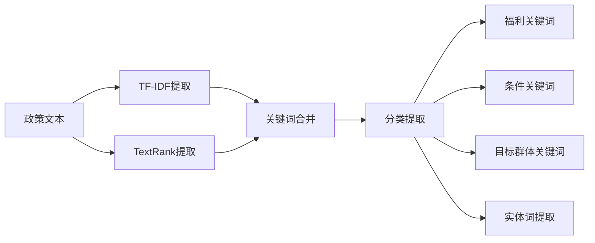

```mermaid
graph LR
    A[政策文本] --> B[TF-IDF提取]
    A --> C[TextRank提取]
    B --> D[关键词合并]
    C --> D
    D --> E[分类提取]
    E --> F[福利关键词]
    E --> G[条件关键词]
    E --> H[目标群体关键词]
    E --> I[实体词提取]
```
