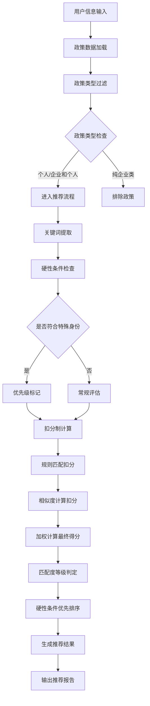

```mermaid
graph TD
    A[用户信息输入] --> B[政策数据加载]
    B --> C[政策类型过滤]
    C --> D{政策类型检查}
    D -->|个人/企业和个人| E[进入推荐流程]
    D -->|纯企业类| F[排除政策]
    
    E --> G[关键词提取]
    G --> H[硬性条件检查]
    H --> I{是否符合特殊身份}
    I -->|是| J[优先级标记]
    I -->|否| K[常规评估]
    
    J --> L[扣分制计算]
    K --> L
    L --> M[规则匹配扣分]
    M --> N[相似度计算扣分]
    N --> O[加权计算最终得分]
    
    O --> P[匹配度等级判定]
    P --> Q[硬性条件优先排序]
    Q --> R[生成推荐结果]
    R --> S[输出推荐报告]
```
